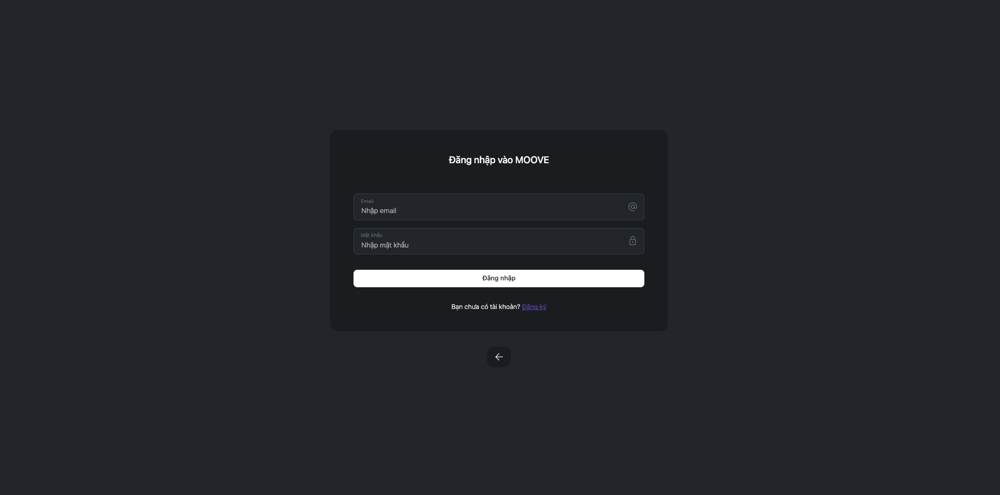
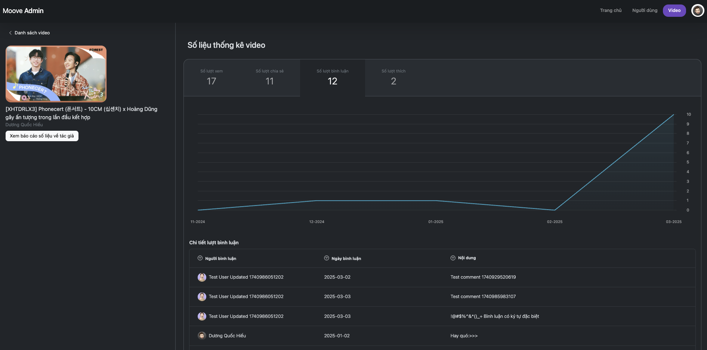
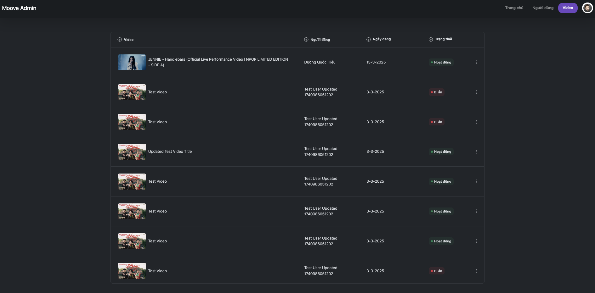
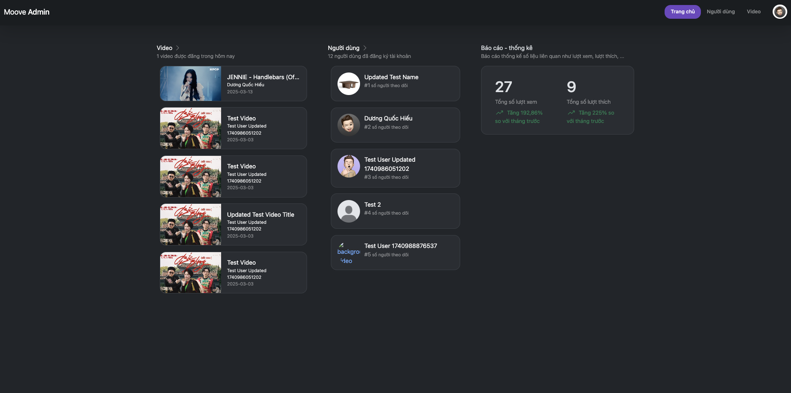

# Mạng xã hội Video Moovee
Đây là một website mạng xã hội cho phép người dùng tương tác với nhau qua những bài đăng video được liên hiển thị thông qua các đường dẫn video **Youtube**. Với những thao tác cơ bản của người dùng như: đăng ký, đăng nhập, đăng video thông qua youtube, chỉnh sửa thông tin. Trang web còn bao gồm các công cụ dành cho quản trị viên như quản lý video, người dùng, báo cáo số liệu, thông tin về người dùng và video theo tháng.
## Demo

## Tính năng
1. Tính năng chung cho quản trị viên và người dùng
  - Đăng nhập, đăng ký
  - CRUD Profile
  - Đăng video
  - Thích, chia sẻ, bình luận video
  - Theo dõi người dùng
2. Tính năng dành cho quản trị viên
  - Thống kê video, người dùng theo tháng
  - Quản lý người dùng
  - Quản lý video
