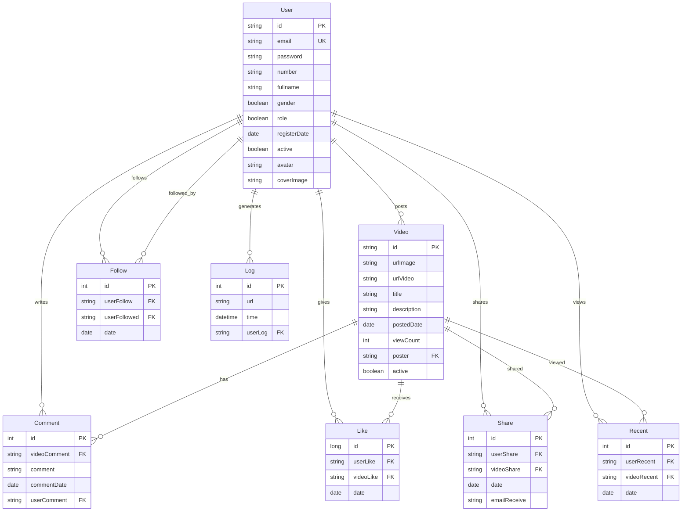

# 🎬 Mạng Xã Hội Video Moovee

<div align="center">
  

  [](https://www.oracle.com/java/)
  [](https://jakarta.ee/)
  [](https://hibernate.org/)
  [](https://www.microsoft.com/sql-server)
  [](https://maven.apache.org/)
</div>

## 📖 Tổng Quan Dự Án

**Moovee** là một nền tảng mạng xã hội video hiện đại được xây dựng bằng Java Enterprise Edition, cho phép người dùng chia sẻ, khám phá và tương tác với nội dung video từ YouTube. Dự án được thiết kế với kiến trúc MVC rõ ràng, sử dụng các công nghệ tiên tiến và tuân thủ các best practices trong phát triển ứng dụng web enterprise.

### 🎯 Mục Tiêu Chính
- Tạo ra một không gian chia sẻ video thân thiện và dễ sử dụng
- Cung cấp trải nghiệm người dùng mượt mà với giao diện responsive
- Xây dựng hệ thống quản trị mạnh mẽ với báo cáo chi tiết
- Đảm bảo bảo mật và hiệu suất cao

## 🛠️ Công Nghệ Sử Dụng

### Backend Technologies
- **Java 21** - Ngôn ngữ lập trình chính
- **Jakarta Servlet API 6.1.0** - Xử lý HTTP requests/responses
- **Hibernate ORM 7.0** - Object-Relational Mapping
- **Jakarta Persistence API (JPA)** - Quản lý dữ liệu
- **Microsoft SQL Server** - Cơ sở dữ liệu chính
- **Maven** - Quản lý dependencies và build tool

### Frontend Technologies
- **JSP (Jakarta Server Pages)** - Server-side rendering
- **JSTL (Jakarta Standard Tag Library)** - Template library
- **Bootstrap 5** - CSS framework responsive
- **Bootstrap Icons** - Icon library
- **JavaScript** - Client-side scripting

### Utilities & Libraries
- **Lombok** - Giảm boilerplate code
- **Jackson** - JSON processing
- **Gson** - JSON serialization/deserialization
- **BCrypt** - Password hashing
- **Apache Commons** - Utility libraries
- **JavaMail API** - Email functionality

## 🏗️ Kiến Trúc Hệ Thống

### Mô Hình MVC (Model-View-Controller)
```
┌─────────────────┐    ┌─────────────────┐    ┌─────────────────┐
│     VIEW        │    │   CONTROLLER    │    │     MODEL       │
│   (JSP Pages)   │◄──►│   (Servlets)    │◄──►│   (Entities)    │
│                 │    │                 │    │                 │
│ - home.jsp      │    │ - HomeController│    │ - User.java     │
│ - profile.jsp   │    │ - UserController│    │ - Video.java    │
│ - admin.jsp     │    │ - AdminController│   │ - Comment.java  │
└─────────────────┘    └─────────────────┘    └─────────────────┘
                                │
                                ▼
                       ┌─────────────────┐
                       │    SERVICE      │
                       │    LAYER        │
                       │                 │
                       │ - UserService   │
                       │ - VideoService  │
                       │ - LikeService   │
                       └─────────────────┘
                                │
                                ▼
                       ┌─────────────────┐
                       │   REPOSITORY    │
                       │     LAYER       │
                       │                 │
                       │ - UserRepo      │
                       │ - VideoRepo     │
                       │ - LikeRepo      │
                       └─────────────────┘
```

### Cấu Trúc Thư Mục
```
src/
├── main/
│   ├── java/
│   │   ├── config/          # Cấu hình ứng dụng
│   │   ├── controller/      # Controllers (Servlets)
│   │   ├── filter/          # Security filters
│   │   ├── model/           # Entity models & DTOs
│   │   ├── repository/      # Data access layer
│   │   ├── service/         # Business logic layer
│   │   └── util/            # Utility classes
│   ├── resources/
│   │   └── META-INF/        # JPA configuration
│   └── webapp/
│       ├── WEB-INF/         # Web configuration
│       └── views/           # JSP templates & assets
```

## 🗄️ Cơ Sở Dữ Liệu

### Entity Relationship Diagram


### Các Bảng Chính

#### 👤 User Table
- **Chức năng**: Lưu trữ thông tin người dùng
- **Đặc điểm**: UUID primary key, email unique, role-based access

#### 🎥 Video Table
- **Chức năng**: Quản lý thông tin video từ YouTube
- **Đặc điểm**: Lưu URL YouTube, metadata, view count

#### 💬 Comment Table
- **Chức năng**: Hệ thống bình luận video
- **Đặc điểm**: Relationship với User và Video

#### ❤️ Like Table
- **Chức năng**: Hệ thống like/unlike video
- **Đặc điểm**: Composite relationship, prevent duplicate likes

#### 📤 Share Table
- **Chức năng**: Chia sẻ video qua email
- **Đặc điểm**: Email integration, tracking shared content

#### 👥 Follow Table
- **Chức năng**: Hệ thống theo dõi người dùng
- **Đặc điểm**: Many-to-many self-referencing relationship

## ✨ Tính Năng Chính

### 🔐 Xác Thực & Phân Quyền
- **Đăng ký tài khoản** với validation email và số điện thoại
- **Phân quyền role-based**: User và Admin
- **Session management** với timeout tự động
- **Security filters** bảo vệ các route quan trọng

### 👤 Quản Lý Người Dùng
- **Profile cá nhân** với avatar và cover image
- **Chỉnh sửa thông tin** cá nhân (fullname, gender, contact)
- **Upload ảnh** với file management system
- **Theo dõi người dùng** khác
- **Lịch sử hoạt động** và logging

### 🎬 Quản Lý Video
- **Đăng video** thông qua YouTube URL
- **Metadata management**: title, description, thumbnail
- **Video categorization** và tagging
- **View count tracking** tự động
- **Video status** (active/inactive)

### 💝 Tương Tác Xã Hội
- **Like/Unlike** video với real-time counting
- **Comment system** với threading support
- **Share video** qua email với HTML template
- **Recently viewed** video tracking
- **Social feed** với pagination

### 📊 Admin Dashboard
- **User management**: CRUD operations, user statistics
- **Video management**: Content moderation, analytics
- **Monthly reports**: User registration, video uploads, engagement
- **System analytics**: View counts, like trends, user activity
- **Data visualization** với charts và graphs

### 📧 Email Integration
- **Share notifications** với custom HTML templates
- **Welcome emails** cho người dùng mới
- **SMTP configuration** với Gmail integration
- **Email templates** responsive design

## 🚀 Cài Đặt & Triển Khai

### Yêu Cầu Hệ Thống
- **Java Development Kit (JDK) 21+**
- **Apache Maven 3.8+**
- **Microsoft SQL Server 2019+**
- **Apache Tomcat 10+ hoặc Jakarta EE compatible server**
- **Git** cho version control

### Bước 1: Clone Repository
```bash
git clone https://github.com/your-username/Video_Social_Network_Moovee.git
cd Video_Social_Network_Moovee
```

### Bước 2: Cấu Hình Database
1. **Tạo database trong SQL Server:**
```sql
CREATE DATABASE VIDEO_ASS_JAVA4;
```

2. **Cập nhật thông tin kết nối trong `persistence.xml`:**
```xml
<property name="jakarta.persistence.jdbc.url"
          value="jdbc:sqlserver://localhost:1433;database=VIDEO_ASS_JAVA4;encrypt=true;trustServerCertificate=true"/>
<property name="jakarta.persistence.jdbc.user" value="your_username"/>
<property name="jakarta.persistence.jdbc.password" value="your_password"/>
```

### Bước 3: Cấu Hình Email (Tùy chọn)
Cập nhật thông tin SMTP trong `SendEmail.java`:
```java
private static final String USERNAME = "your_email@gmail.com";
private static final String PASSWORD = "your_app_password";
```

### Bước 4: Build & Deploy
```bash
# Build project với Maven
mvn clean compile

# Package thành WAR file
mvn package

# Deploy lên Tomcat
cp target/ASSSIGNMENT-1.0-SNAPSHOT.war $TOMCAT_HOME/webapps/moovee.war
```

### Bước 5: Khởi Động Ứng Dụng
1. Start SQL Server
2. Start Tomcat server
3. Truy cập: `http://localhost:8080/moovee`

### 🐳 Docker Deployment (Tùy chọn)
```dockerfile
FROM tomcat:10-jdk21
COPY target/ASSSIGNMENT-1.0-SNAPSHOT.war /usr/local/tomcat/webapps/moovee.war
EXPOSE 8080
CMD ["catalina.sh", "run"]
```

## 📱 Screenshots & Demo

### 🏠 Trang Chủ
<div align="center">
  
  <p><em>Giao diện trang chủ với danh sách video trending và navigation</em></p>
</div>

### 🔐 Đăng Nhập
<div align="center">
  
  <p><em>Form đăng nhập với validation và responsive design</em></p>
</div>

### 👤 Trang Cá Nhân
<div align="center">
  
  <p><em>Profile người dùng với video đã đăng và thông tin cá nhân</em></p>
</div>

### 🎬 Quản Lý Video (Admin)
<div align="center">
  
  <p><em>Dashboard quản lý video với CRUD operations</em></p>
</div>

### 📊 Báo Cáo Thống Kê
<div align="center">
  
  <p><em>Báo cáo analytics với charts và metrics</em></p>
</div>

### 🛠️ Admin Dashboard
<div align="center">
  
  <p><em>Tổng quan hệ thống với các metrics quan trọng</em></p>
</div>